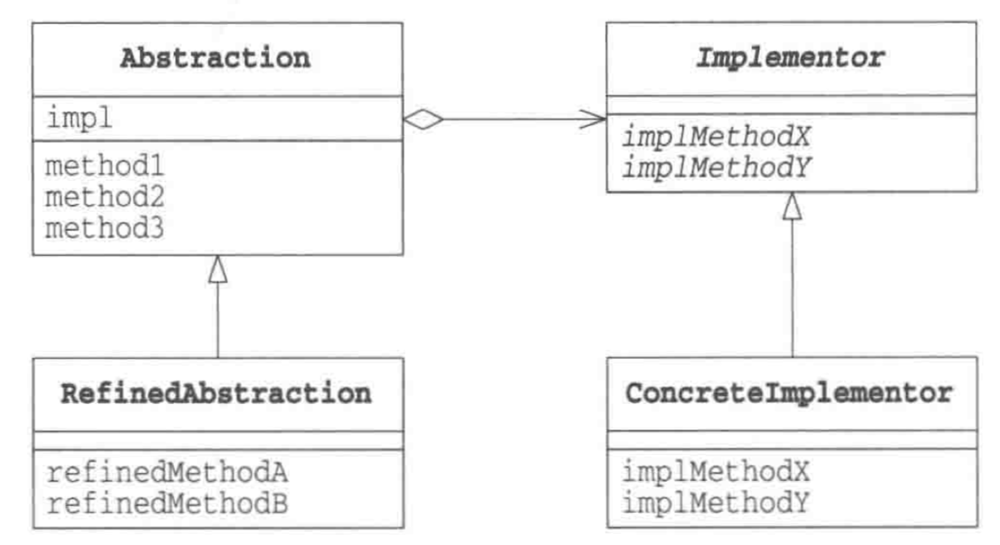
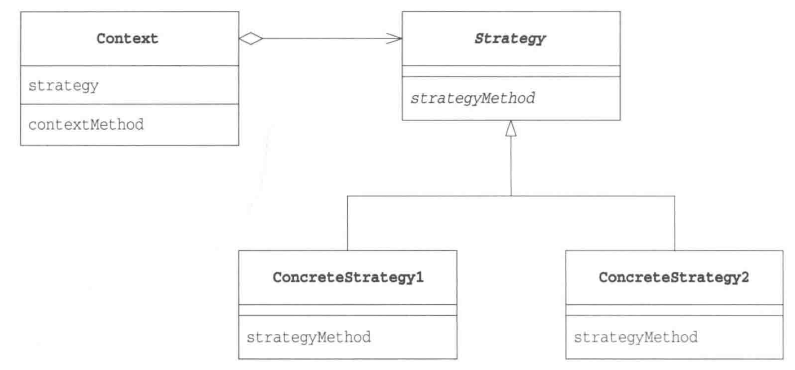
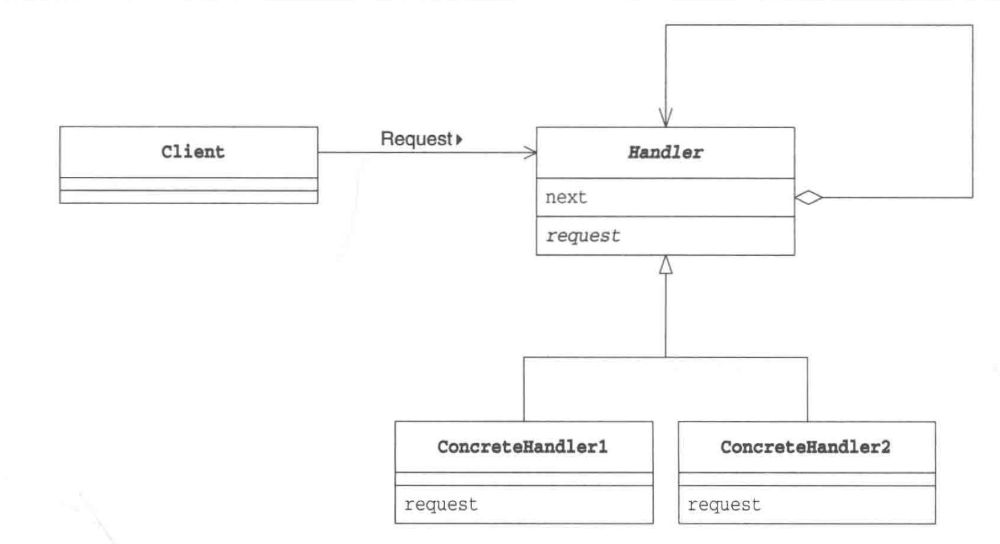
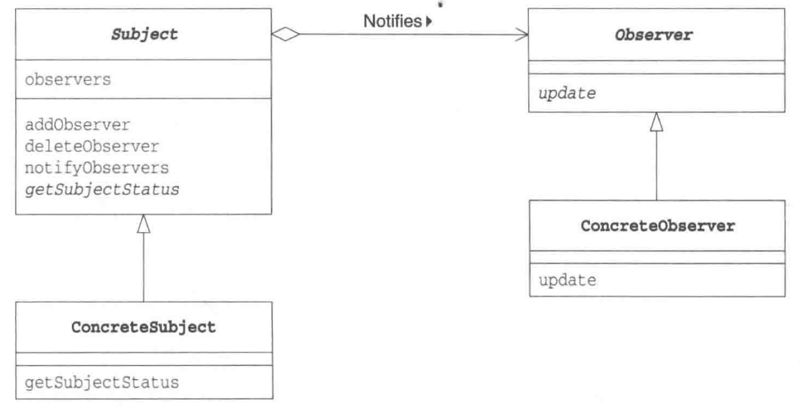
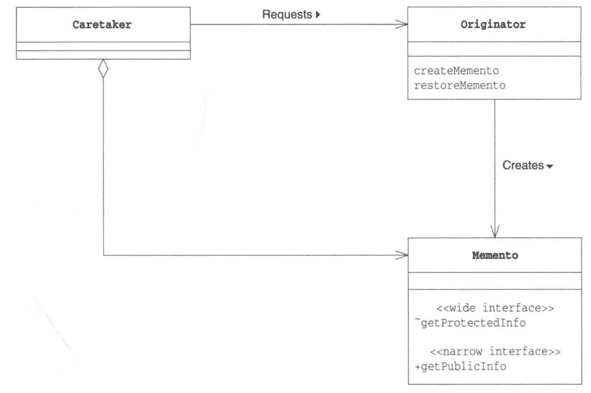
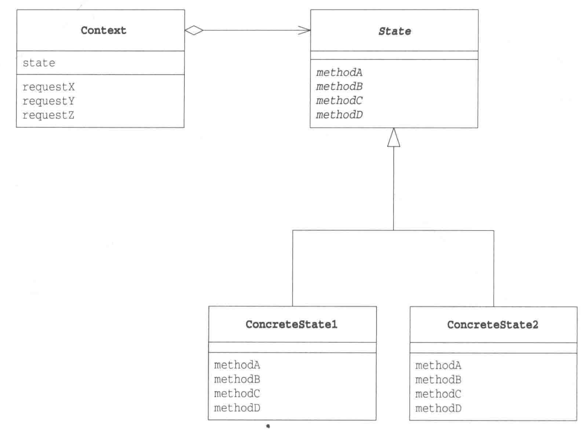
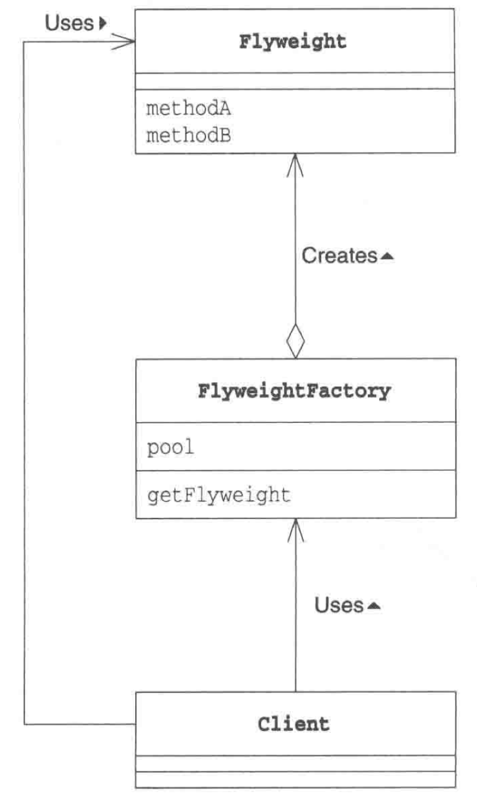
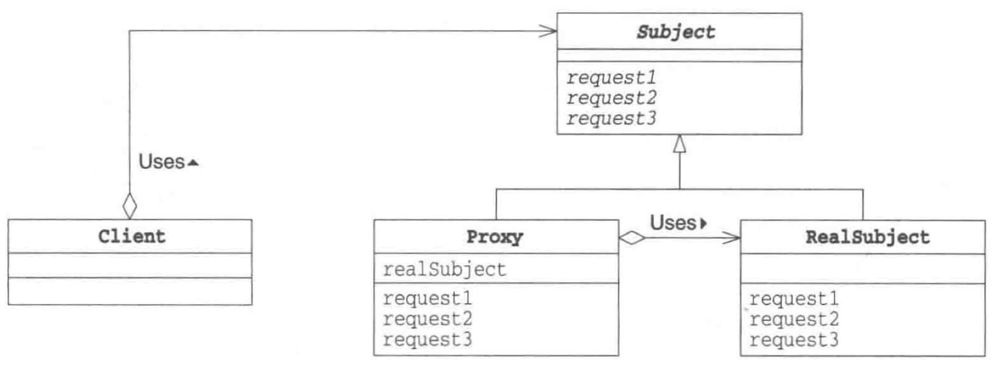
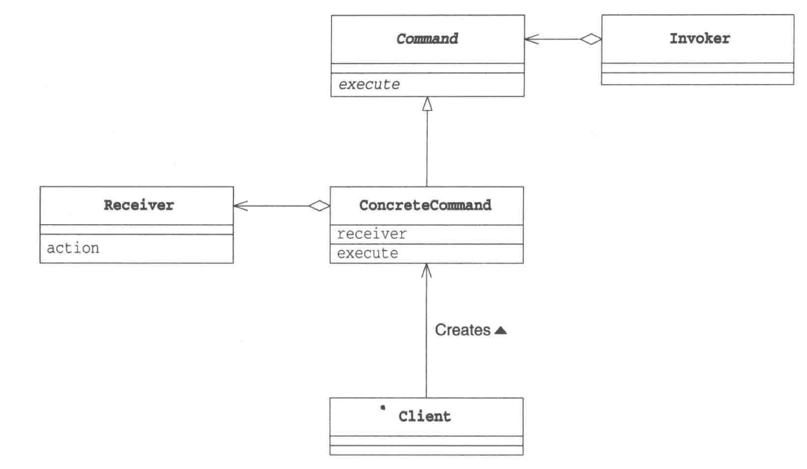

## Bridge Pattern

#### 目的：

将“类的功能层次”和“类的实现层次”分开。当要修改类的功能时不会影响类的实现，当修改类的实现时，不会修改类的功能。两者分居Bridge的两边。



```java
//one bridge side
class Abstraction {
    //负责功能
    Implementor impl;
    
    void method1() {
        impl.method1();
    }
    
    void method2() {
        impl.method2();
    }
}

class RefinedAbstraction {}

//the other bridge side
interface Implementor {
    //负责实现
    void method1();
    void method2();
}

class ConcreteImplementor implements Implementor {
  //...
}
```

当需要修改实现时，只需要继承 `Implementor`即可；当需要修改功能时，只需要继承`Abstraction`即可。当然这里的继承可能过于耦合，可以使用委托、组合等方法。

## Strategy Pattern

#### 目的：

将程序中的算法（Strategy）和其他部分（Context）隔离开，通过API对算法进行调用，通过委托来使用算法。这样使得修改算法时，对其他部分不会造成影响。

#### 替代：

使用函数引用替代Strategy即可



```java
class Context {
    Strategy strategy;
    
    void contextMethod() {
        //use strategy.strategyMethod()
    }
}

interface Strategy {
    void strategyMethod();
}

class ConcreteStrategy implements Strategy {
    //...
}
```

#### 其他优势：

事实上此pattern也支持运行时的`strategy`切换。

可以使用一种算法去验算另一种算法的正确性。

## Composite Pattern

#### 目的：

使容器和其元素具有一致性（多个和单个的一致性），并创造出递归结构。例如：目录和文件当作同一种东西看待。

```java
interface Component {
    //methods..
}

//the element
class Leaf implements Component {
    //methods...
}

class Composite implements Component {
    List<Leaf> children;
    
    void addChild() {} 
    void removeChild() {}
}
```

## Decorator Pattern

#### 目的：

装饰物（`Decorator`）和被装饰物（`ConcreteComponent`）具有一致性，它们实现同一个接口，对外界调用者来说是透明的。

Decorator Pattern可以形成一种递归结构。被装饰物本身可能也是套了其他被装饰物的装饰物。

不修改被装饰物而增加功能。

#### 缺点：

会使程序中增加很多功能类似的很小的类。


## Prototype Pattern

#### 目的：

通过实例生成同一类型的另一个实例（`clone`）

## Visitor Pattern

#### 目的：

模拟double dispatch

```java
interface Visitor {
    void visit(ConcreteElementA a); //real handler
    void visit(ConcreteElementB b); //real handler
}

interface Element {
    void accept(Visitor v);
}

class ConcreteElementA {
    void accept(Visitor v) {
        v.visit(this);
    }
}

class ConcreteElementB {
    void accept(Visitor v) {
        v.visit(this);
    }
}
```


## Chain of Responsibility Pattern

#### 核心思想：

弱化了请求发出者和请求处理者的关系，不需要一个上帝角色去决定谁处理请求。

chain可以被动态地改变。

当一个人被要求做什么事情时，如果他可以做就自己做，如果不能做就将“要求”转给另外个人。下ー个人如果可以自己处理，就自己做；如果也不能自己处理，就再转给另外一个人。

#### 缺点：

与直接判断谁能处理并转发相比，chain of responsibility可能造成处理延迟。



```java
//Client 相当于 Main
class Client {
	void request(Handler firstHandler, Trouble t) {
        firstHandler.support(t);
    }
}

abstract class Handler {
    Handler nextHandler;
    abstract boolean request(Trouble t);
    void support(Trouble t) {
        if (!request(t)) {
			if (nextHandler == null) {
                //the chain cannot handle
			} else {
                nextHandler.request(t);
            }
        }
    }
}

class ConcreteHandler1 extends Handler {
    boolean request(Trouble t) {}
}

class ConcreteHandler2 extends Handler {
    boolean request(Trouble t) {}
}
```

使用链表的形式串起`Handler`，如果本实例可以处理，那么返回`true`，否则返回`false`并且传递给下一个责任人。

## Facade Pattern

`Facade`承担着调用各个组件的角色（对组件的关系是单向的），而`Client`负责调用`Facade`。

`Facade`的作用是让API变少了，`Facade`承担着关键节点的作用，因此可以被递归地使用。

`Facade`有时是Singleton。

```java
//package A
class Client {
    public static void main(String[] args) {
        new Facade().use();
    }
}

//package B
class Facade {
    void use() {} {
        //use ComponentA.f1() and ComponentB.f2()
    }
}

//package B
class ComponentA {
    void f1();
}

//package B
class ComponentB {
    void f2();
}
```


## Mediator Pattern

`Mediator`负责与`Colleague`们进行通信，并作出决定。此模式将分散的通信集中起来管理。

```java
class Mediator {
    //mediator has a bunch of Colleague
    void notify() {}
}

abstract class Colleague {
    Mediator mediator;
    control();
}
```

`Colleague`通过`Mediator`的`notify()`方法和`Mediator`通信；反之，`Mediator`通过`Control`方法和`Colleague`通信。

这种通信有时通过Observer模式实现。

与`Facade`相比，Mediator Pattern的通信是双向的。


## Observer Pattern (Publish-Subscribe Pattern)

`Subject`是被观察者。



`Observer`注册在`Subject`中，如果有事件，`Subject`就通过`update()`通知`Observer`。

这里，`ConcreteSubject`不必知道谁在观察，只需要调用`update()`即可通知。

MVC中的`View`对应于`Observer`，`Model`对应于`Subject`。

## Memento Pattern

Memento Pattern常常用于历史记录/快照的恢复撤销



`Originator`负责保存最新的`Memento`或者根据给定的`Memento`对象恢复成对应的状态。

`Memento`负责保存某一时刻的状态（snapshot，history）。

`CareTaker`决定`Originator`是否保存当前的状态为`Memento`以及是否恢复到某个`Memento`所保存的状态。

## State Pattern

使用`class`的多态来避免`if-else`硬编码。



## Flyweight Pattern

#### 思想：

通过尽量共享实例来避免`new`出实例。



相当于用工厂产生对象，从外部看，不知道底层到底是共享的还是单独`new`的。看上去可以使用`COW`机制进行管理。

## Proxy Pattern



`Subject`使得`Proxy`和`RealSubject`具有一致的接口，从而`Client`不必在乎用的是谁。

`Proxy`会尽量自己来处理来自`Client`的信息（比如惰性求值），只有当自己不能处理时，才会将工作交给`RealSubject`角色。

## Command Pattern

将对方法的调用变为对物的调用，能方便地管理历史记录，也方便将一堆命令整合在一起执行。

#### 替代：

使用`method reference`或`functor`



## Interpreter Pattern

一个解释器/编译器前端的模式。